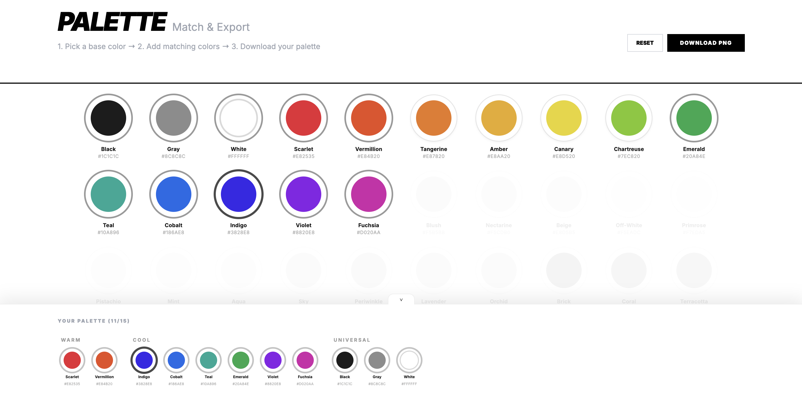

# pallete-maker

A personal color tool for building harmonious palettes: interactive grid up to 15 colors with LCH harmonies and PNG export.

[](https://pallete-maker.vercel.app)

## Stack

- Static HTML/CSS/JS, no framework or bundler
- Color harmony powered by [chroma-js](https://gka.github.io/chroma.js/) 2.4.2 (CDN, SRI-pinned)
- PNG export via [html2canvas](https://html2canvas.hertzen.com/) 1.4.1 (CDN, SRI-pinned)
- Styling: Tailwind CSS pre-compiled locally
- Inter font via Google Fonts
- Build: `scripts/build-static.mjs` produces `dist/index.html`
- Hosting: Vercel (Git integration, preview deploys for PRs)
- CI: GitHub Actions (`baseline-checks`, `pr-guard`, `ai-review`, `osv-scan`)
- Security baseline: CSP, HSTS, and `X-Frame-Options` headers via `vercel.json`; Dependabot weekly with 7-day cooldown; Google OSV Scanner on every PR; third-party GitHub Actions pinned to commit SHA

## Getting started

This project uses **pnpm** (pinned via `packageManager` in `package.json`). The easiest way to get the right version is Node's built-in [`corepack`](https://nodejs.org/api/corepack.html):

```bash
corepack enable
pnpm install --frozen-lockfile
pnpm run build       # produce dist/index.html
pnpm run preflight   # full local gate: feature-memory, baseline, html, build, format, tests
```

Open `dist/index.html` directly in a browser, or serve `dist/` with any static server to preview the build.

## License

Released under the [MIT License](./LICENSE). © 2026 Kristina Aquila.
